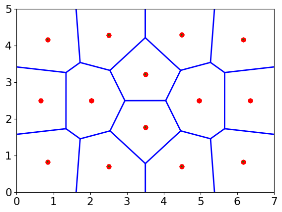

# SweepLineVT -- Voronoi Tessellation using sweep-line algorithm
## Description
* Voronoi Tessellation on the basis of the sweep-line algorithm developed by Steven Fortune in 1986
* Make centroidal Voronoi Tessellation (CVT)
* Make Delaunay triangulation
* Take accurate positions of points with no need of pixelation / binning.
* Confine Voronoi diagram to a rectangular region
## Examples
### Make Voronoi Tessellation for a list of points
* The content of "example.dat"

```
-0.5 1.5
1.1 3.3
2.9 5.7
3.1 4.3
5.4 2.6
6.3 3.1
```

```
slvt.py example.dat --calCentroid
pl_VT.py example_VT.dat example_ctd.dat -s
```

The red points are the Voronoi sites (input points from "example.dat"). The green lines connect each sites with the corresponding cell centroid.


### Make centroidal Voronoi Tessellation (CVT) of 14 points in 0<x<7, 0<y<5.
```
slvt.py --makeCVT 14 --border 0,7,0,5 -s
pl_VT.py CVT14_VT.dat -s
```

"-s" of slvt.py means "silent". "-s" of pl_VT.py means "step".

* One possible result you might see:   

